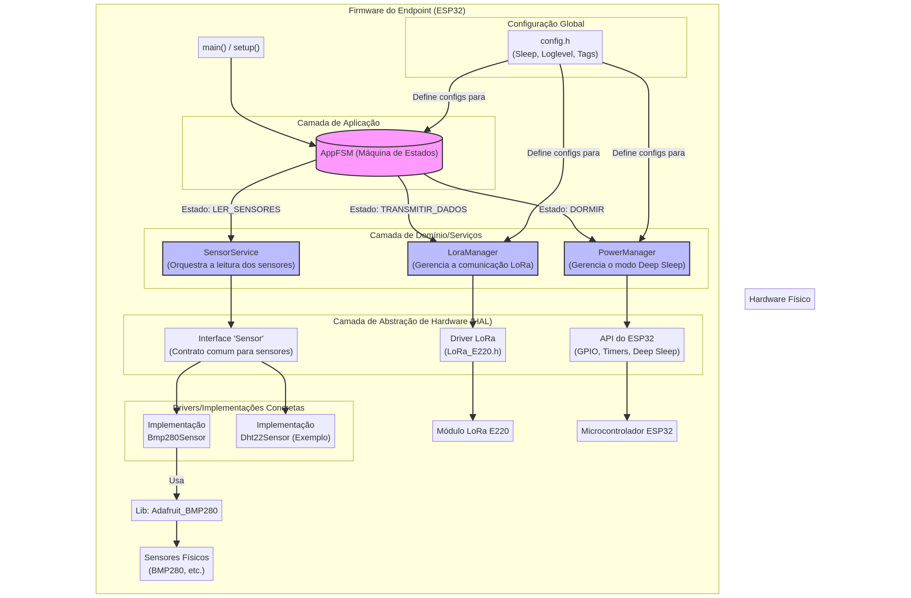

# Firmware do EndPoint LoRa para ESP32

## Introdução

Este repositório contém o firmware de teste para um endpoint LoRaWAN, projetado para monitoramento ambiental em pequenas propriedades rurais. O firmware foi desenvolvido para o microcontrolador ESP32 em conjunto com o módulo LoRa EByte E220-900T22D.

O projeto é parte de uma solução de IoT maior que visa fornecer uma rede de comunicação de baixo custo, baixo consumo de energia e longo alcance para aplicações agrícolas.

## Topologia da Rede

A arquitetura da rede é baseada no protocolo LoRaWAN, seguindo uma topologia star-of-stars. Endpoints com sensores se conectam a gateways locais, que então encaminham os dados para os servidores de rede e de aplicação.

Para uma descrição detalhada dos componentes da rede (Endpoints, Gateways, Servidores) e um diagrama do sistema, por favor, consulte o documento de [Topologia da Rede](./net_topology.md).

## Arquitetura do Firmware

O firmware foi projetado com uma arquitetura modular e em camadas para garantir escalabilidade, manutenibilidade e facilidade de desenvolvimento.

### Conceitos Chave da Arquitetura:

- Design em Camadas: O código é separado em três camadas principais:
    - Camada de Aplicação: Uma Máquina de Estados Finitos (FSM) controla o fluxo lógico principal (Inicializar, Ler Sensores, Transmitir, Dormir).
    - Camada de Domínio/Serviços: Gerencia tarefas específicas como a comunicação LoRa, aquisição de dados de sensores e gerenciamento de energia.
    - Camada de Abstração de Hardware (HAL): Isola a lógica da aplicação dos drivers de hardware específicos, permitindo a fácil substituição de sensores ou outros componentes.    
- Abstração de Sensores: Uma interface Sensor é utilizada para desacoplar a aplicação principal das implementações de sensores específicos. Isso permite adicionar novos sensores sem alterar a lógica central da aplicação.
- Baixo Consumo por Design: A aplicação opera de forma cíclica, acordando para realizar tarefas e, em seguida, entrando em modo de sono profundo (Deep Sleep) para conservar a energia da bateria.



## Como Contribuir

Pré-requisitos:

- Visual Studio Code  
- Extensão PlatformIO IDE
- Uma placa de desenvolvimento ESP32 (ex: DOIT ESP32 DEVKIT V1).
- Dois módulos LoRa EByte E220.
- Sensores necessários (o firmware atual está configurado para um sensor BMP280).

## Clonar o Repositório

```Bash
git clone https://github.com/lucasvchaves/LoRa-Test.git
cd LoRa-Test
```

## Compilar e Enviar (Build & Upload)

1. Abra o projeto no VS Code:
    - Abra o Visual Studio Code
    - Clique no ícone do PlatformIO (cabeça de formiga) na barra lateral.
    - Clique em "Open Project".
    - Navegue até a pasta LoRa-Test-main clonada e clique em "Open".
2. Conecte seu ESP32:
    - Conecte sua placa ESP32 ao seu computador via USB.
3. Compile o projeto:
    - Na barra lateral do PlatformIO, expanda as opções do ambiente esp32doit-devkit-v1.
    - Clique na tarefa "Build". O PlatformIO fará o download automático das bibliotecas necessárias e compilará o firmware.
4. Envie o firmware:
    - Após a compilação bem-sucedida, clique na tarefa "Upload" na barra lateral do PlatformIO. Isso irá gravar o firmware no seu ESP32.
5. Monitore a saída:
    - Clique na tarefa "Monitor" para abrir o monitor serial e visualizar os logs de saída do dispositivo. A velocidade do monitor está configurada para 115200 baud.

## Configuração

Parâmetros chave do firmware podem ser facilmente configurados no arquivo `include/config.h`:

- Intervalo de Sono: SLEEP_INTERVAL_HOURS define por quanto tempo o dispositivo permanece em Deep Sleep entre os ciclos de medição e transmissão.
- Definições de Pinos: Os pinos GPIO usados para o módulo LoRa e outros periféricos são definidos neste arquivo.
- Tags de Logging: Você pode customizar as tags usadas para depurar diferentes módulos.

## Bibliotecas

Este projeto depende das seguintes bibliotecas principais, que são gerenciadas automaticamente pelo PlatformIO conforme definido em platformio.ini:

- `xreef/EByte LoRa E220` library: Para comunicação com o módulo LoRa.
- `adafruit/Adafruit BMP280` Library: Driver para o sensor de temperatura e pressão BMP280.
- `adafruit/Adafruit Unified Sensor` : Biblioteca de abstração de sensores da Adafruit.

## Licença

Este projeto é licenciado sob a Licença MIT. Veja o arquivo LICENSE para mais detalhes.